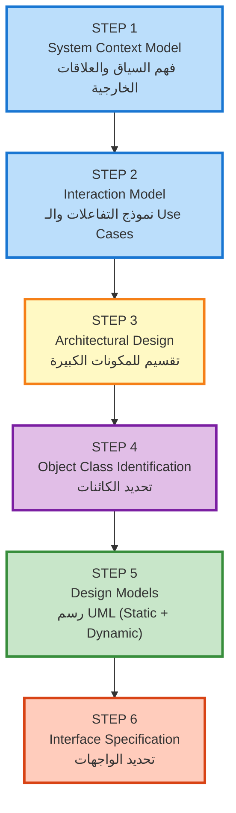

# المحاضرة 4 — Design and Implementation (التصميم والتطبيق)
> **المادة:** هندسة البرمجيات (المستوى الثالث) | **الموضوع:** تصميم وتطبيق الأنظمة البرمجية

---

## الجزء الأول: الشرح التفصيلي

### 1. مقدمة عن التصميم والتطبيق

#### 📍 أين نحن الآن؟
بعد تحديد متطلبات النظام، ننتقل لمرحلة تحويل هذه المتطلبات إلى نظام برمجي قابل للتنفيذ.

#### ⬅️ الربط مع السابق
المتطلبات (Requirements) تخبرنا **ماذا** نبني؛ التصميم والتطبيق يخبرنا **كيف** نبنيه.

#### 💡 الفكرة الأساسية
**مرحلة التصميم والتطبيق هي المرحلة التي نطور فيها النظام البرمجي الذي يعمل بالفعل (Executable Software System).**

---

#### 📖 الشرح

**تطوير البرمجيات** ينقسم لعمليتين أساسيتين متسلسلتين:

**1. Software Design (التصميم البرمجي)**
- هي عملية **إبداعية** تحدد بنية النظام وعلاقات مكوناته
- نحدد **أي components** (مكونات) تشكل النظام
- نحدد **كيف** هذه المكونات ترتبط ببعضها
- كل شيء يبني على أساس **متطلبات العميل**
- الهدف: تصميم معمّاري واضح قبل كتابة أي كود

**2. Software Implementation (التطبيق)**
- هي عملية **تحويل** التصميم إلى برنامج فعلي
- كتابة الكود بناءً على خطة التصميم
- تجميع البرنامج وجعله قابل للتشغيل

**ملاحظة مهمة:** التصميم قد يكون:
- **منفصل تماماً**: رسمي، موثّق بـ UML diagrams (في الأنظمة الكبيرة)
- **في رأس المبرمج**: رسمة على whiteboard أو فكرة عامة (في المشاريع الصغيرة)
- **لا يحتاج UML دائماً**: في Python أو لغات ديناميكية، قد لا تحتاج رسوميات معقدة

#### 🎯 الملخص السريع
- التصميم = تحديد البنية والعلاقات
- التطبيق = كتابة الكود الفعلي
- لا يوجد "صيغة سحرية" — يعتمد على حجم المشروع والفريق

#### 📚 التطبيق
في تطوير اللعبة أو تطبيق e-commerce:
- **التصميم**: نحدد أن اللعبة فيها Graphics Engine، AI System، Physics Engine
- **التطبيق**: نكتب الكود لكل engine وتربطهم معاً

#### ⚠️ أخطاء شائعة

#### الفهم الخاطئ ❌:
"يمكن نبدأ نكتب كود مباشرة بدون تصميم"

#### الفهم الصحيح ✅:
حتى في المشاريع الصغيرة، تحتاج فكرة عامة عن البنية. التصميم ما معناه دائماً رسومات معقدة — قد تكون ببساطة خطة واضحة في رأسك.


#### 📄 النص الأصلي من المحاضرة
<details>
<summary>عرض النص الأصلي (coverage: 100%)</summary>

> Software design and implementation is the phase at which an executable software system is developed.
> 
> Software design is creative activity in which you identify software components and their relationships based on customer's requirements.
> 
> Software implementation is the process of realizing the design as a program.
> 
> Sometimes, there is a separate design stage — the design is modeled and documented. Other times, a design is in the programmer's head or sketched on a whiteboard or paper.
> 
> It isn't necessary to describe the design in detail using UML or other description languages, use it when OO, not Python!

**ملاحظة على التغطية:**
- ✓ تم شرح التعريفات بالكامل
- ✓ تم شرح الفرق بين Design و Implementation
- ✓ تم شرح متى نستخدم UML ومتى لا
- ℹ️ إضافة من الدليل: توضيح أن التصميم قد يكون غير رسمي

</details>

---

### 2. Object-Oriented Design (التصميم الموجه للكائنات)

#### 📍 أين نحن الآن؟
الآن بنركز على **كيفية تصميم الأنظمة** باستخدام منهج Object-Oriented.

#### ⬅️ الربط مع السابق
التصميم الموجه للكائنات هو الطريقة الحديثة الأساسية لتصميم الأنظمة البرمجية.

#### 💡 الفكرة الأساسية
**التصميم الموجه للكائنات يتبع خمس خطوات منطقية تبدأ من فهم السياق والتفاعلات وتنتهي بتصميم النموذج الكامل.**

---

#### 📊 المخطط: خطوات التصميم الموجه للكائنات



**ملاحظة حاسمة:** كل خطوة **يجب** تكون قبل التالية. لا يمكن تحديد الكائنات (4) قبل فهم البنية المعمّارية (3).

---

#### 📖 الشرح التفصيلي

لتطوير نظام تصميم موجه للكائنات، نحتاج:

**1️⃣ فهم السياق والتفاعلات الخارجية (Context & Interactions)**
- ما هو النظام بالضبط؟
- من يستخدمه؟ (Actors/Stakeholders)
- ما هي الأنظمة الخارجية التي يتفاعل معها؟
- النتيجة: نرسم **System Context Diagram** و **Interaction Model**

**مثال من المحاضرة**: في نظام محطات الطقس:
- النظام: محطة الطقس
- العناصر الخارجية: Control System، Weather Information System، Satellite
- التفاعل: محطة الطقس ترسل البيانات، تستقبل أوامر

**2️⃣ تصميم البنية المعمّارية (Architecture)**
- نقسّم النظام لـ major components (مكونات كبيرة)
- كل component يعامل كـ "صندوق أسود" مع مسؤولية محددة
- نرسم **Subsystem Diagram**

**مثال**: نظام محطة الطقس ينقسم لـ:
- Data Collection Subsystem
- Communication Subsystem
- Power Manager Subsystem
- Configuration Manager Subsystem

**3️⃣ تحديد الكائنات الرئيسية (Object Identification)**
- لا توجد "صيغة سحرية" — يعتمد على خبرة المصمم
- نستخدم عدة طرق:
  - **Grammatical Analysis**: Nouns = Objects، Verbs = Operations
  - **Tangible Entities**: Things (Aircraft)، Roles (Manager)، Events (Request)، Locations، Organizational Units
  - **Scenario-based Analysis**: نمر على كل scenario، نحدد الكائنات المشاركة
  - **Behavioral Approach**: نحدد الكائنات بناءً على من يشارك في أي سلوك

**4️⃣ تطوير نماذج التصميم (Design Models)**
- نرسم **UML Diagrams** توضح الكائنات والعلاقات

**5️⃣ تحديد الواجهات (Interface Specification)**
- نحدد بوضوح: ما الخدمات التي يقدمها كل كائن؟
- Signatures و Semantics للدوال

#### 🎯 الملخص السريع
- 5 خطوات متسلسلة من Context إلى Interface
- لا توجد طريقة واحدة صحيحة — تختلف حسب المشروع
- التصميم عملية **تكرارية** — قد تحتاج تعديلات

#### 📚 التطبيق
- في لعبة: نفهم اللاعب والمحتوى (Context) → نصمم العناصر (Objects) → نحدد طريقة تفاعلها
- في تطبيق e-commerce: نفهم المستخدمين والمتاجر → نصمم Shopping Cart، Payment، Inventory

#### ⚠️ أخطاء شائعة

#### الفهم الخاطئ ❌:
"يجب أتبع الخطوات 5 بالضبط نفس ترتيبها حرفياً"

#### الفهم الصحيح ✅:
الخطوات موجهات عامة، قد تعود للخلف إذا اكتشفت معلومة جديدة.


#### 📄 النص الأصلي من المحاضرة
<details>
<summary>عرض النص الأصلي (coverage: 100%)</summary>

> To develop a system design, we need:
> 1. Understand & define the context and the external interactions with the system
> 2. Design the system architecture
> 3. Identify the principal objects in the system
> 4. Develop design models
> 5. Specify interfaces

**ملاحظة على التغطية:**
- ✓ شرح الخطوات الخمس
- ✓ شرح Context و Interactions
- ✓ شرح Identification methods
- ℹ️ إضافة من الدليل: توضيح العملية التكرارية

</details>

---

### 2.1. System Context Model (نموذج سياق النظام)

#### 📍 أين نحن الآن؟
أول خطوة عملية: رسم البيئة الخارجية للنظام.

#### 💡 الفكرة الأساسية
**نموذج السياق يوضح النظام بصرياً وسط الأنظمة الأخرى التي يتفاعل معها.**

---

#### 📊 المخطط: System Context Model للمحطة الجوية (من المحاضرة)

**النموذج الدقيق من الـ PDF:**

```
                         ┌─────────────────────────┐
                         │  Weather Information    │
                         │  System                 │
                         │  (System الخارجي)       │
                         └────────────┬────────────┘
                                      │
                                      │ 1
                                      │
        ┌─────────────────────────────┼────────────────────┐
        │                             │                    │
        │                             │                    │
┌───────▼──────────┐        ┌─────────▼──────────┐    ┌───▼───────────┐
│   Control        │        │  Weather Station   │    │  Satellite    │
│   System         │        │  (النظام بتاعنا)   │    │  Link         │
│                  │        │                    │    │               │
│ (External)       │        │ (Our System)       │    │ (External)    │
└────────┬─────────┘        └─────────┬──────────┘    └───┬───────────┘
         │ 1                          │ 1.n                │
         │                            │                    │
         └────────────────┬───────────┘                    │
                          │                                │
                          └────────────────┬───────────────┘
                                          │
                                   (Communication via Satellite)
```

**التوضيح بالـ Associations:**
- Weather Station (النظام بتاعنا) ←→ Weather Information System (1:1)
- Weather Station ←→ Control System (1:1)  
- Weather Station ←→ Satellite (1:n) — متصل مع satellites متعددة
- System Boundaries واضحة: كل شيء خارج الـ Box برتقالي = External

**الفائدة:** يوضح أن:
- ✓ محطة الطقس **لا تتصل مباشرة** مع Weather Information System
- ✓ **يجب** الاتصال عبر Satellite Link
- ✓ Control System يقدر يعطيها أوامر مباشرة

#### 📖 الشرح

**System Context Model** = رسم **structural** بسيط يوضح:
- **أين** النظام بتاعنا
- **مين** الأنظمة الأخرى حوله
- **كيف** يتصل بهم

**التمثيل:** 
- نستخدم **associations** (خطوط ربط) توضح العلاقات
- أو **simple block diagram** (مربعات وخطوط بسيطة)

**الفائدة:** نحدد **system boundaries** (حدود النظام):
- ما الـ features الموجودة **داخل** نظامنا
- ما الـ features الموجودة **خارجه** (في أنظمة أخرى)

#### 🎯 الملخص السريع
- رسم بسيط يوضح السياق
- تحديد واضح لحدود النظام
- يساعد في تجنب confusions عند بداية التصميم

#### 📚 التطبيق
في لعبة multiplayer:
- النظام = Game Client
- الأنظمة الخارجية = Game Server، Database، Payment System
- السياق يوضح: هل Client يتصل مباشرة بـ Database؟ (عادة لا — يمر عبر Server)

#### 📄 النص الأصلي من المحاضرة
<details>
<summary>عرض النص الأصلي (coverage: 95%)</summary>

> System context model: a structural model that demonstrates the other systems in the environment of the system being developed.
> 
> Understanding the context è establish the system boundaries:
> - So you identify which features are implemented in system, and which in other associated systems
> 
> Context model:
> - is represented using associations
> - associations simply show the relationships
> - we could use simple block diagram

**ملاحظة على التغطية:**
- ✓ شرح التعريف والفائدة
- ⚠️ لم يتم شرح "associations" بالتفصيل
- ℹ️ إضافة: مثال من لعبة multiplayer

</details>

---

### 2.2. Interaction Model (نموذج التفاعلات)

#### 📍 أين نحن الآن؟
بعد فهم السياق، نوضح **كيف** النظام يتفاعل مع البيئة.

#### ⬅️ الربط مع السابق
System Context يقول **من** الأنظمة الأخرى؛ Interaction Model يقول **كيف** التفاعل يحصل.

#### 💡 الفكرة الأساسية
**نموذج التفاعلات يوضح كل الحالات الممكنة اللي يستخدم فيها النظام (Use Cases).**

---

#### 📊 المخطط: Interaction Model (Use Cases) — من الـ PDF

**جميع الـ Use Cases الفعلية:**

```
                              Weather Station System
     ┌─────────────────────────────────────────────────────────────┐
     │                                                              │
     │  ┌─────────────────┐     ┌──────────────────┐              │
     │  │  Report Weather │     │  Report Status   │              │
     │  └────────┬────────┘     └────────┬─────────┘              │
     │           │                       │                         │
     │  ┌────────┴──────────────┬────────┴──────────┐              │
     │  │                       │                   │              │
     │  ▼                       ▼                   ▼              │
     │  O                       O                   O              │
     │  |\ Weather Info      |\ Control         |\ Restart    │
     │  | \ System           | \ System         | \ Shutdown  │
     │  |  \                 |  \               |  \          │
     │  |   O                |   O              |   O         │
     │  └─────────────────────┴─────────────────┴──────┘     │
     │                                                              │
     │  Additional Use Cases:                                      │
     │  • Remote Control (shutdown, restart, reconfigure,         │
     │    powersave)                                               │
     │                                                              │
     └─────────────────────────────────────────────────────────────┘
     
     KEY ACTORS:
     • Weather Information System — يطلب البيانات
     • Control System — يرسل أوامر و يطلب الحالة
```

**جدول Use Cases الدقيق من المحاضرة:**

| Use Case | Actor | Description | Trigger |
|----------|-------|-------------|---------|
| **Report Weather** | Weather Information System | Station يجمّع البيانات ويرسلها | WIS يطلب البيانات عبر Satellite |
| **Report Status** | Control System | Station ترسل حالتها الحالية | Control System يطلب الحالة |
| **Shutdown** | Control System | إيقاف المحطة | أمر من Control System |
| **Restart** | Control System | تشغيل المحطة من جديد | أمر من Control System |
| **Reconfigure** | Control System | تغيير settings المحطة | أمر من Control System |
| **Power Save** | Control System | تقليل استهلاك الطاقة | أمر من Control System |

**ملاحظة:** جميع الـ Use Cases عند المحطة (System) — الـ Actors خارجيين يطلبونها.

#### 📖 الشرح

**Interaction Model** = نموذج **dynamic** يوضح:
- **كل الطرق** اللي المستخدمون (أو أنظمة أخرى) يمكن يستخدموا النظام
- كل طريقة استخدام = **Use Case**
- لا نحتاج تفاصيل كثيرة — فقط ملخص العمليات الرئيسية

**مثال من المحاضرة**: محطة الطقس:
- **Use Case 1: Report Weather** 
  - Actor: Weather Information System
  - الإجراء: النظام يجمع البيانات ويرسلها
- **Use Case 2: Report Status**
  - Actor: Control System
  - الإجراء: النظام يرسل حالته الحالية
- **Use Case 3: Remote Control**
  - Actor: Control System
  - الإجراء: يستقبل أوامر (shutdown, restart, reconfigure)

#### 🎯 الملخص السريع
- Use cases = الطرق الممكنة لاستخدام النظام
- Actors = الأشياء الخارجية (أشخاص أو أنظمة) تستخدم النظام
- ملخص بسيط بدون تفاصيل معقدة

#### 📚 التطبيق
في لعبة:
- Use Case: Player Logs In → Authentication System
- Use Case: Player Attacks Enemy → Combat System
- Use Case: Player Saves Game → File System

#### ⚠️ أخطاء شائعة

#### الفهم الخاطئ ❌:
"يجب أشرح كل use case بتفاصيل معقدة جداً"

#### الفهم الصحيح ✅:
في هذه المرحلة، نكتفي بـ high-level overview. التفاصيل تأتي لاحقاً.


#### 📄 النص الأصلي من المحاضرة
<details>
<summary>عرض النص الأصلي (coverage: 100%)</summary>

> Interaction model: a dynamic model that shows how the system interacts with its environments as it is used.
> 
> Interactions of a system with its environment [does not include too much detail]
> 
> We can use a use case model:
> - Each possible interaction is named in ellipse
> - External entity involved in the interaction is represented by stick figure

**ملاحظة على التغطية:**
- ✓ شرح التعريف والفائدة
- ✓ شرح Use Case Diagram
- ℹ️ إضافة: أمثلة من لعبة

</details>

---

### 2.3. Architectural Design (التصميم المعمّاري)

#### 📍 أين نحن الآن؟
بعد فهم التفاعلات، نحدد **كيف** النظام ينقسم لأجزاء أكبر.

#### 💡 الفكرة الأساسية
**نحدد major components (مكونات كبيرة) والتفاعلات بينها باستخدام architectural patterns.**

---

#### 📊 المخطط: Architecture Design للمحطة (من الـ PDF)

**البنية المعمّارية الدقيقة:**

```
┌─────────────────────────────────────────────────────────────────┐
│  WEATHER STATION SYSTEM ARCHITECTURE                            │
├─────────────────────────────────────────────────────────────────┤
│                                                                  │
│  ┌─────────────────┬───────────────────┬──────────────────────┐ │
│  │ ◄subsystem►     │ ◄subsystem►       │ ◄subsystem►          │ │
│  │ Fault Manager   │ Configuration     │ Power Manager        │ │
│  │                 │ Manager           │                      │ │
│  └────────┬────────┴─────────┬─────────┴──────────────┬───────┘ │
│           │                  │                        │         │
│           └──────────────────┼────────────────────────┘         │
│                              │                                   │
│           ╔═════════════════════════════════════════╗           │
│           ║  Communication Link (Satellite)        ║           │
│           ║  (Central Hub/Bus)                     ║           │
│           ╚══════════════════╤═════════════════════╝           │
│                              │                                   │
│           ┌──────────────────┼────────────────────┐             │
│           │                  │                    │             │
│  ┌────────▼────────┐ ┌───────▼────────┐ ┌───────▼─────────┐   │
│  │ ◄subsystem►     │ │ ◄subsystem►    │ │ ◄subsystem►     │   │
│  │ Communications  │ │ Data Collection│ │ Instruments     │   │
│  │                 │ │                │ │                 │   │
│  │ • Receiver      │ │ • Transmitter  │ │ • Thermometer   │   │
│  │ • Processor     │ │ • Logger       │ │ • Anemometer    │   │
│  │                 │ │ • Formatter    │ │ • Barometer     │   │
│  └─────────────────┘ └────────────────┘ └─────────────────┘   │
│                                                                  │
└─────────────────────────────────────────────────────────────────┘

SUBSYSTEMS (6 كاملة):
1. Fault Manager — إدارة الأخطاء والـ recovery
2. Configuration Manager — تعديل settings
3. Power Manager — إدارة الطاقة والـ power saving
4. Communications — الاتصال عبر Satellite
5. Data Collection — جمع البيانات من الأجهزة
6. Instruments — الأجهزة الفعلية (thermometers, etc.)

CONNECTIONS:
• Communication Link = Hub مركزي (كل subsystems متصلة به)
• Management subsystems (1,2,3) = تحكم على الـ resources
• Operational subsystems (4,5,6) = تشتغل مع البيانات

PATTERN USED:
Layered Architecture:
  - Layer 1 (Top): Management (Fault, Config, Power)
  - Layer 2 (Middle): Communication Link
  - Layer 3 (Bottom): Operations (Comms, Data Collection, Instruments)
```

**المهم: Communication Link ليست subsystem عادية — هي الـ Bus الرئيسي اللي كل الـ subsystems متصلة بيه!**

#### 📖 الشرح

**Architectural Design** بتحدد:
1. **Major Components** = الأجزاء الكبيرة اللي تشكل النظام
   - مثال: Data Collection، Communications، Instruments
2. **كيفية ترتيبها** = استخدام architectural patterns
   - مثل: Layered Architecture (طبقات)، Client-Server، Pipeline

**الفائدة:**
- الفريق يقدر يشتغل على components مختلفة بشكل متوازي
- كل component واضحة مسؤولياتها
- سهل نقسّم الشغل على المبرمجين

#### 🎯 الملخص السريع
- Major components مع واضح responsibilities
- Architecture pattern (layered, modular, etc.)
- يمكّن parallel development

#### 📚 التطبيق
في لعبة 3D:
- **Graphics Engine**: يرسم الرسوميات
- **Physics Engine**: يحسب الحركة والتصادمات
- **AI System**: يحكّم سلوك العدو
- **Event System**: يربط الأجزاء ببعضها

#### 📄 النص الأصلي من المحاضرة
<details>
<summary>عرض النص الأصلي (coverage: 95%)</summary>

> After defining the interactions è design architectural design
> - Identify major components that make up the system and their interactions
> - Organize the components using an architectural pattern

**ملاحظة على التغطية:**
- ✓ شرح الخطوة
- ⚠️ لم يتم شرح patterns بالتفصيل (خارج نطاق المحاضرة)
- ℹ️ إضافة: توضيح الفوائد العملية

</details>

---

### 2.4. Object Class Identification (تحديد الكائنات)

#### 📍 أين نحن الآن؟
الآن نروح للتفاصيل: **كل component من components الكبيرة تحتوي كائنات صغيرة.**

#### 💡 الفكرة الأساسية
**تحديد الكائنات عملية صعبة وتكرارية — لا توجد "صيغة سحرية"، يعتمد على خبرة وفهم domain.**

---

#### 📖 الشرح

**الحقيقة المرّة:** 
- لا توجد algorithm واحد يقول: "الكائنات دي والكائنات دي"
- تعتمد على:
  - **Skill**: الخبرة في البرمجة
  - **Experience**: شغلت مشاريع زي هاي
  - **Domain Knowledge**: فهمت المجال اللي بتشتغل فيه

**Object identification = عملية تكرارية:**
- تحتاج لمحاولات أكتر من مرة
- ما رح تنجح من المحاولة الأولى

#### الطرق المختلفة:

**1. Grammatical Analysis (تحليل لغوي)**
- Nouns (أسماء) = Objects
- Verbs (أفعال) = Operations/Methods

مثال من نص محطة الطقس:
- "weather station **records** local **weather information**"
- Objects: WeatherStation، WeatherData
- Operations: records، transmits

**2. Tangible Entities (الأشياء الملموسة)**
- **Things**: Aircraft، Weather، Temperature
- **Roles**: Manager، Doctor، User
- **Events**: Request، Update
- **Locations**: Office، Room
- **Organizational Units**: Company، Department

**3. Scenario-based Analysis (تحليل سيناريوهات)**
- نأخذ كل use case
- نمر على خطواته
- نحدد: من الأشياء اللي تشارك في هالـ use case؟

**4. Behavioral Approach (المنهج السلوكي)**
- نحدد الكائنات بناءً على السلوك
- "من يفعل هذا؟" → هاي بتكون object

#### 🎯 الملخص السريع
- لا صيغة سحرية — تجربة واختيار
- طرق متعددة: grammatical، entities، scenarios، behavioral
- التصميم تكراري — قد تعدّل الكائنات لاحقاً

#### 📚 التطبيق
في لعبة منصات:
- **Grammatical**: character **jumps** على **platform** → Character, Platform classes
- **Entities**: Enemy, Weapon, PowerUp
- **Scenario**: Player Jumps → في تفاعل بين Player و Gravity
- **Behavioral**: من يتحرك؟ Player. من يسقط؟ Everything.

#### ⚠️ أخطاء شائعة

#### الفهم الخاطئ ❌:
"يجب أخمّن الكائنات الصحيحة من أول مرة"

#### الفهم الصحيح ✅:
حتى الخبراء يعدّلون الكائنات كم مرة. هذا جزء من العملية.


#### 📄 النص الأصلي من المحاضرة
<details>
<summary>عرض النص الأصلي (coverage: 100%)</summary>

> Identifying object classes is often a difficult part of object oriented design.
> 
> There is no 'magic formula' for object identification. It relies on the skill, experience and domain knowledge of system designers.
> 
> Object identification is an iterative process. You are unlikely to get it right first time.
> 
> Use a grammatical analysis of a natural description of the system to be constructed:
> - Objects & attributes are nouns
> - Operations or services are verbs
> 
> Or, use tangible entities (things) in the app. domain:
> - Things: ex, Aircraft
> - Roles: ex, manager, doctor
> - Events: ex, request
> - Interactions: ex, meetings
> - Location: ex, offices
> - Organizational units: ex, companies
> 
> Use a scenario-based analysis. The objects, attributes and methods in each scenario are identified
> 
> Use a behavioural approach and identify objects based on what participates in what behaviour

**ملاحظة على التغطية:**
- ✓ شرح الصعوبة والطرق
- ✓ شرح كل طريقة
- ✓ شرح طبيعة العملية التكرارية

</details>

---

### 3. Design or System Model (نموذج التصميم)

#### 📍 أين نحن الآن؟
الآن عندنا الكائنات — نحتاج **رسم** كيفية ترابطهم.

#### 💡 الفكرة الأساسية
**نموذج التصميم يوضح بـ UML الكائنات والعلاقات بينها، ويحقق جسر بين المتطلبات والتطبيق.**

---

#### 📖 الشرح

**Design Model** يجب:
- يُظهِر **object classes** (الكائنات)
- يُظهِر **associations** (الروابط بين الكائنات)
- يكون **bridge** بين requirements و implementation
- يكون **abstract** (ما نحتاج تفاصيل ثانوية)
- يحتوي **enough detail** للمبرمجين يكتبوا الكود

#### أنواع النماذج:

**1. Structural Models (النماذج الهيكلية — Static)**
- توضح بنية النظام الثابتة
- أمثلة:
  - **Subsystem Models**: أجزاء النظام الكبيرة (Class Diagram with Packages)
  - **Class Diagrams**: تفصيل كل class

**2. Dynamic Models (النماذج الديناميكية — Runtime Behavior)**
- توضح السلوك أثناء التشغيل
- أمثلة:
  - **Sequence Models/Sequence Diagrams**: تسلسل الاستدعاءات بين Objects
  - **State Machine Models/State Diagrams**: كيف object يتغير حالته

#### 🎯 الملخص السريع
- Static = البنية الثابتة
- Dynamic = السلوك والتفاعلات
- يجب معاً لفهم كامل النظام

#### 📚 التطبيق
في لعبة:
- **Static**: Character, Enemy, Weapon classes وعلاقاتهم
- **Dynamic**: تسلسل الأحداث عند الهجوم

#### ⚠️ أخطاء شائعة

#### الفهم الخاطئ ❌:
"يجب أرسم 13 UML diagrams (كل الأنواع)"

#### الفهم الصحيح ✅:
استخدم فقط الـ diagrams اللي تحتاج. في الأغلب: Class Diagram + Sequence Diagram كافيين.


#### 📄 النص الأصلي من المحاضرة
<details>
<summary>عرض النص الأصلي (coverage: 95%)</summary>

> Design or System Model:
> - Shows objects or object classes in a system
> - Shows associations between entities
> - is bridge between system requirements and implementation
> - have to be abstract, no need for unnecessary details
> - have to include enough detail for programmers to make implementation
> 
> In UML, there are about 13 different types of models. No need to all of them — Could be useful in some type of software
> 
> In UML, we normally develop two kinds of design model:
> - Structural models (static)
> - Dynamic models

**ملاحظة على التغطية:**
- ✓ شرح الأهداف
- ✓ شرح النوعين
- ℹ️ إضافة: عدم الحاجة لكل الـ 13 types

</details>

---

### 3.1. Structural Models — Class Diagram

#### 📍 أين نحن الآن؟
نوضح البنية الثابتة للكائنات.

#### 💡 الفكرة الأساسية
**Class Diagram توضح Classes والعلاقات بينهم (Inheritance, Association, Composition).**

---

#### 📖 الشرح

**Class Diagram يظهر:**
- **Classes**: كل class في صندوق
- **Attributes**: البيانات الموجودة في class
- **Methods**: العمليات اللي يقدر يعملها
- **Relationships**:
  - **Generalization** (Inheritance): `<|—` (ترث من)
  - **Uses/Used-by**: `—>` (تاستخدم)
  - **Composition**: `◆—` (مكوّنة من)

**مثال بسيط:**
```
┌─────────────────────┐
│    Character        │
├─────────────────────┤
│ - health: int       │
│ - name: string      │
├─────────────────────┤
│ + takeDamage()      │
│ + heal()            │
└─────────────────────┘
```

#### 🎯 الملخص السريع
- كل class = مربع
- يحتوي attributes و methods
- العلاقات توضح كيف classes ترتبط

#### 📚 التطبيق
في لعبة:
- Character class و Enemy class يرث من Character
- Weapon class و Character يرتبط بـ association (Character يستخدم Weapon)

#### 📄 النص الأصلي من المحاضرة
<details>
<summary>عرض النص الأصلي (coverage: 90%)</summary>

> Structural models:
> - Describe the static structure of the system by using object classes & relationships
> - Important relationships may be documented such as:
>   - Generalization relationships
>   - Uses/used-by relationships
>   - Composition relationships
> 
> Subsystem models: shows logical grouping of objects into coherent subsystems, i.e. class diagram, each subsystem is shown as a package

**ملاحظة على التغطية:**
- ✓ شرح الـ relationships
- ⚠️ تفاصيل الرسم الدقيقة موجودة في المحاضرة الأصلية
- ℹ️ إضافة: مثال من لعبة

</details>

---

### 3.2. Dynamic Models — Sequence & State Diagrams

#### 📍 أين نحن الآن؟
نوضح كيف الكائنات تتفاعل أثناء التشغيل.

#### 💡 الفكرة الأساسية
**Dynamic models توضح تسلسل الأحداث وتغيّر الحالات.**

---

#### 📖 الشرح

**Dynamic Models ينقسم لنوعين:**

**1. Sequence Diagram (تسلسل العمليات)**
- توضح **ترتيب** استدعاءات methods بين objects
- الوقت على المحور العمودي
- كل object على أفقي
- Arrows توضح الاستدعاءات

**مثال من محاضرة:**
- Weather Station يستقبل طلب
- يردّ بـ acknowledge
- يجمع البيانات
- يرسل للـ Communication Link
- الـ Link ترسل للـ Weather System

**2. State Diagram (حالات الكائن)**
- توضح كيف object يتغير من حالة لحالة
- Ovals = states (states)
- Arrows = transitions (انتقالات)
- Labels على arrows توضح events

**مثال من محاضرة:**
محطة الطقس لها states:
- Shutdown
- Configuring
- Running
- Collecting
- Summarizing
- Transmitting
- Controlled
- Testing

#### 🎯 الملخص السريع
- Sequence: ترتيب الاستدعاءات
- State: تغيّر الحالات
- معاً بتعطي صورة كاملة للسلوك

#### 📚 التطبيق
في لعبة:
- **Sequence**: Player Presses Jump → Physics Engine يحسب → Graphics Engine يرسم
- **State**: Character في states: Idle, Jumping, Falling, Landing

#### ⚠️ ملاحظة مهمة

"لا تحتاج state diagram لكل object. الأشياء البسيطة (مثل سلاح بسيط) ما تحتاج. فقط الأشياء المعقدة."

#### 📄 النص الأصلي من المحاضرة
<details>
<summary>عرض النص الأصلي (coverage: 95%)</summary>

> Dynamic models such as:
> - Sequence models: shows the sequence of object interactions
> - State machine model: shows how individual objects change their state in response to events
> 
> Sequence models show the sequence of object interactions that take place:
> - Objects are arranged horizontally across the top
> - Time is represented vertically so models are read top to bottom
> - Interactions are represented by labelled arrows
> - A thin rectangle in an object lifeline represents the time when the object is the controlling object

**ملاحظة على التغطية:**
- ✓ شرح النوعين
- ✓ شرح تفاصيل Sequence
- ⚠️ تفاصيل State diagram موجودة لكن اختصرت

</details>

---

### 4. Interface Specification (تحديد الواجهات)

#### 📍 أين نحن الآن؟
آخر جزء من التصميم: بوضوح **كيف** الأشياء تتصل ببعضها.

#### 💡 الفكرة الأساسية
**تحديد الواجهات يعني تعريف دقيق للخدمات اللي كل component/object توفّر.**

---

#### 📖 الشرح

**Interface Specification يحدد:**
- **Signatures**: المعاملات والـ return types
- **Semantics**: شنو اللي الـ method بتعمل بالضبط
- **Pre-conditions**: شنو اللي لازم يكون صح قبل استدعاء
- **Post-conditions**: شنو نتيجة الاستدعاء

**الفائدة:**
- Multiple teams يقدرون يشتغلوا بشكل مستقل
- طالما يلتزموا بـ interface، كل واحد يعمل على جزء

**أداة التمثيل:**
- **UML**: Class diagrams مع public methods واضحة
- **Java**: Interface keyword

**نقطة مهمة:**
"ما تحتاج تصمّم implementation الـ interface — اخفي details في الـ object نفسه."

#### 🎯 الملخص السريع
- تعريف واضح للـ public methods
- معاملات ونتائج محددة
- يمكّن parallel development

#### 📚 التطبيق
في لعبة:
```
interface Attackable:
  - takeDamage(amount: int): void
  - isDead(): boolean
  
interface Weapon:
  - attack(): int
  - reload(): void
```

#### 📄 النص الأصلي من المحاضرة
<details>
<summary>عرض النص الأصلي (coverage: 100%)</summary>

> Interface between components
> 
> Object interfaces have to be specified so that the objects and other components can be designed in parallel.
> 
> Interface design defines the signatures and semantics of services that are provided by object or group of objects
> 
> The UML uses class diagrams for interface specification but Java may also be used.
> 
> Designers should avoid designing the interface representation but should hide this in the object itself.

**ملاحظة على التغطية:**
- ✓ شرح الفائدة والتعريف
- ✓ شرح كيفية الـ hiding
- ℹ️ إضافة: مثال من لعبة

</details>

---

### 5. Implementation (التطبيق)

#### 📍 أين نحن الآن؟
انتهينا من التصميم. الآن نشتغل على **كتابة الكود**.

#### 💡 الفكرة الأساسية
**Implementation معناها تحويل التصميم لبرنامج فعلي، مع التركيز على Reuse, Configuration Management, و Host-Target Development.**

---

#### 📖 الشرح

**Implementation مو عن كتابة كود من الصفر. التركيز:**

**1. Reuse (إعادة الاستخدام)**
- لا تكتب كود موجود — اعتمد على libraries و components موجودة
- 4 مستويات:
  1. **Abstraction**: استخدم design patterns وخبرة (أعلى مستوى)
  2. **Object**: استخدم libraries (مثل JUnit)
  3. **Component**: قد تحتاج كود تربط components
  4. **System**: استخدم applications كاملة (قد تحتاج تعديلات)

- **الفوائد:**
  - أسرع development
  - أقل bugs (tested قبل)
  - أقل كلفة
  - أكتر reliability

- **التكاليف المرتبطة:**
  - وقت البحث عن reusable elements
  - تكلفة الشراء (خاصة COTS)
  - تكلفة التكييف والتعديل
  - تكلفة التكامل مع components أخرى

**2. Configuration Management (إدارة التكوين)**
- المشروع بيطلع versions كثيرة من كل component
- لازم نتابع: أي version اختبرنا؟ أي version معنا الآن؟
- بدون tracking، قد نستخدم versions خاطئة

**Activities:**
- **Version Management**: تتبع versions
- **System Integration**: تحديد أي versions تستخدم في كل build
- **Problem Tracking**: تقرير bugs وتتبع fixes

**Tools:** ClearCase, Subversion, BugZilla, Git

**3. Host-Target Development (تطوير على جهاز، تشغيل على آخر)**
- نطور على **host** (جهازنا — عادة أقوى)
- نشغّل على **target** (الجهاز النهائي — قد يكون مختلف)
- الفرق: OS، processor، limitations

**مثال:** نطور لعبة على Windows PC، لكن النهاية تشتغل على iOS
- نستخدم **simulators** (emulators) عشان نختبر

#### 🎯 الملخص السريع
- Reuse ≠ كل شيء نكتبه. استخدم اللي موجود
- Configuration management = تتبع دقيق
- Host-target = تطور في مكان، شغّل في آخر

#### 📚 التطبيق
في Launchpad (e-commerce):
- **Reuse**: استخدم frameworks موجودة (Django/Flask/React)
- **Config Management**: متابعة أي version API قيد الاستخدام
- **Host-Target**: تطور على laptop، لكن يشتغل على servers

#### 📄 النص الأصلي من المحاضرة
<details>
<summary>عرض النص الأصلي (coverage: 95%)</summary>

> Implementation is concerned with creating executable version
> 
> Most modern is constructed by reusing existing components [do not reinvent the wheel]
> 
> Reuse levels:
> - Abstraction: use knowledge of successful abstractions in design
> - Object: reuse objects from a library
> - Component: need to write some code
> - System: reuse entire application systems
> 
> Reusing aids to:
> - Develop new systems more quickly
> - Minimize development risks
> - Lower costs
> - More reliable software
> 
> Configuration management system keep track of these versions
> - Version management
> - System integration
> - Problem tracking
> 
> Develop on one computer (host system), execute on a separate computer (target system)

**ملاحظة على التغطية:**
- ✓ شرح كل مستوى من Reuse
- ✓ شرح فوائد
- ✓ شرح Config Management
- ℹ️ إضافة: أمثلة عملية

</details>

---
## الجزء الثاني: ملخص شامل (Alternative Complete Reading)

---

### الفكرة الأساسية

هاي المحاضرة بتحكي عن أهم مرحلتين بعد ما تخلص من المتطلبات: **Design** و **Implementation**. يعني بعد ما تعرف "شنو" العميل بدو، لازم تعرف "كيف" رح تبنيه وبعدين "كيف" رح تكتبه فعلياً كود شغّال. هاي المرحلة هي القلب النابض لأي مشروع برمجي — لأنه هون بيتحدد إذا المشروع رح يطلع منظّم وقابل للصيانة، ولا رح يطلع فوضى ما حدا فاهم شو فيها بعد شهرين.

### ليش يهمك؟

تخيّل حالك بتبني بيت بدون مخطط هندسي — رح تبدأ تبني حيط، وبعدين تكتشف إنه الحمام لازم يكون بمكان تاني، فتهدم وتبني من جديد. بالضبط نفس الشي بصير بالبرمجة لو قفزت على التصميم وبلشت تكتب كود على طول. التصميم بيعطيك "الخارطة" قبل ما تبلش البناء، وهاد بيوفرلك وقت وفلوس وصداع كتير. خاصة انتي كـ co-founder بمشروع Launchpad وبتشتغلوا على BaaS بـ Rust/gRPC، فهم هاي المرحلة صح رح يأثر مباشرة على شكل الـ architecture اللي رح تبنوها.

### المتطلبات السابقة

قبل ما تفهم هاي المحاضرة، لازم يكون عندك فكرة عن:
- شنو هو `Object-Oriented Programming` (OOP) — Classes, Objects, Inheritance
- شنو هو `UML` بشكل عام (حتى لو ما تعرف كل التفاصيل)
- فكرة بسيطة عن `Requirements` — يعني شنو معناها متطلبات النظام

---

### التصميم والتطبيق: شنو الفرق بينهم بالضبط؟

خلّينا نبلش من الأساس. **Software Design** هي عملية إبداعية — نعم، إبداعية مو ميكانيكية — بتحدد فيها شنو الـ components (المكونات) اللي بدك ياها بالنظام، وشلون بترتبط ببعض. هاي العملية بتبنى بالكامل على متطلبات العميل. يعني إذا العميل قالك "بدي نظام يدير مخزون المتجر"، انت هون بتقرر: هل بدي class اسمه Product؟ هل بدي class اسمه Inventory؟ شلون بيتواصلوا مع بعض؟

أما **Software Implementation** فهي ببساطة تحويل هاد التصميم لبرنامج فعلي — يعني كتابة الكود اللي يجسّد القرارات اللي اخدتها بمرحلة التصميم.

النقطة المهمة جداً هون، وهاي غالباً بتلخبط الطلاب: **مو كل تصميم لازم يكون رسمي وموثّق بـ UML**. أحياناً، خاصة بالمشاريع الصغيرة أو لما تشتغل بلغات زي Python (اللي مو object-oriented بشكل صارم زي Java مثلاً)، التصميم ممكن يكون بس فكرة برأس المبرمج، أو رسمة سريعة على whiteboard. المحاضرة بالحرفة بتقول: "استخدم UML لما تشتغل OO، مو لما تشتغل Python!" — يعني الأداة والرسميات بتتغير حسب حجم وطبيعة المشروع.

فكّر فيها هيك: لو عم تبني script صغير يعالج ملف Excel، ما رح تقعد ترسملها Class Diagram وSequence Diagram — بس فكرة برأسك كافية. لكن لو عم تبني نظام بنكي معقد فيه 50 مبرمج، هون لازم تصميم موثّق ورسمي عشان الكل يفهم نفس الشي.

---

### الخطوات الخمس في Object-Oriented Design

هاي الجزء الأساسي بالمحاضرة، وبيتكون من خمس خطوات متسلسلة، كل وحدة منهم بتبني على اللي قبلها. خلّينا نمشي فيهم وحدة وحدة، وبنستخدم مثال محطة الطقس (Weather Station) اللي جابته المحاضرة كـ case study.

**الخطوة الأولى: System Context — فهم السياق والتفاعلات الخارجية**

أول شي لازم تعمله، قبل ما تفكر بأي كود، هو تفهم: النظام بتاعي وين بده يوقف بالنسبة للأنظمة التانية حوله؟ مثلاً بمحطة الطقس، النظام بتاعنا (Weather Station) بيتواصل مع Control System (يعطيها أوامر زي "أطفي" أو "اعمل restart")، ومع Weather Information System (يطلب منها بيانات الطقس)، ومع Satellite (وسيلة الاتصال).

الفكرة الأساسية هون: نحدد **حدود النظام** (system boundaries). يعني نعرف شنو الوظائف اللي **نحن** رح نبنيها بنظامنا، وشنو الوظائف اللي موجودة **بأنظمة تانية** ومو من شغلنا. هاد مهم كتير لأنه بدون هاد الفهم، ممكن تبلش تبني features مو من مسؤوليتك، أو تنسى features لازم تكون موجودة عندك.

لتمثيل هاد بصرياً، بنستخدم **System Context Model** — وهو structural model (يعني بيوضح البنية، مو السلوك) بيستخدم associations (خطوط ربط) بين نظامنا والأنظمة الخارجية. ممكن نرسمه بـ simple block diagram — مربعات وخطوط، بسيط جداً.

**الخطوة الثانية: Interaction Model — نموذج التفاعلات**

بعد ما عرفنا مين حوالينا (Context)، لازم نعرف **كيف** بيصير التفاعل بالضبط. هون بندخل على مفهوم الـ **Use Case** — يعني حالة استخدام محددة للنظام. كل use case بيمثل طريقة واحدة يقدر فيها actor (شخص أو نظام خارجي) يستخدم نظامنا.

بمثال محطة الطقس، عندنا Use Cases زي: "Report Weather" (Weather Information System بيطلب البيانات)، و"Report Status" (Control System بيطلب حالة المحطة)، و"Remote Control" (Control System بيرسل أوامر زي shutdown, restart, reconfigure, powersave).

المهم هون: **ما بدنا تفاصيل كتير بهاي المرحلة**. المحاضرة بتنص صراحة على هاد: "does not include too much detail". يعني إحنا بس عم نعطي overview عام لكل الطرق الممكنة لاستخدام النظام، بدون الدخول بتفاصيل كل خطوة بالضبط — هاد رح يجي لاحقاً بالـ Sequence Diagrams.

لتمثيل هاد، بنستخدم **Use Case Diagram**: كل use case بيتمثل بـ ellipse (بيضاوي)، والـ actor (الكيان الخارجي) بيتمثل بـ stick figure (رسمة إنسان بسيطة).

**الخطوة الثالثة: Architectural Design — التصميم المعمّاري**

هون بنبدأ نفكر بالبنية الكبيرة للنظام. بعد ما عرفنا كل التفاعلات الممكنة، لازم نحدد: النظام بدو ينقسم لأي أجزاء كبيرة (major components)؟ وشلون هاي الأجزاء بترتبط ببعضها؟

بمثال محطة الطقس، النظام انقسم لستة subsystems: Fault Manager (إدارة الأخطاء)، Configuration Manager (إدارة الإعدادات)، Power Manager (إدارة الطاقة) — هدول الثلاثة بيشكلوا طبقة الإدارة. وبعدين عندنا Communication Link كنقطة اتصال مركزية. وأخيراً Communications، Data Collection، و Instruments كطبقة تنفيذية.

الفايدة الأساسية من هاي الخطوة إنها بتسمح للفريق يشتغل بشكل متوازي — كل مبرمج أو فريق صغير ياخد subsystem وحده ويشتغل عليه لحاله، طالما الكل ملتزم بالـ interfaces المتفق عليها. هاد بيسرّع التطوير كتير بالمشاريع الكبيرة.

**الخطوة الرابعة: Object Class Identification — تحديد الكائنات**

هاي أصعب خطوة، وبصراحة، المحاضرة بتقول هاد بالحرفة: "There is no 'magic formula' for object identification." يعني ما في صيغة سحرية أو خوارزمية تقولك بالضبط شنو الـ classes اللي لازم تعملها. الموضوع بيعتمد على **خبرة المصمم**، و**فهمه لمجال العمل** (domain knowledge)، وكمان — وهاد مهم — إنها عملية **تكرارية** (iterative). يعني حتى الخبراء ما بيوصلوا للتصميم الصحيح من أول محاولة، وغالباً بيرجعوا يعدّلوا.

في أربع طرق أساسية تقدر تستخدمها:

الطريقة الأولى: **Grammatical Analysis** — تحليل لغوي. تاخد وصف النظام بالكلام العادي، وتحدد: الأسماء (nouns) بتصير objects، والأفعال (verbs) بتصير operations أو methods. مثلاً لو الوصف بيقول "weather station **records** local **weather information**" — هون "weather station" و"weather information" هدول objects محتملة، و"records" هي operation.

الطريقة الثانية: **Tangible Entities** — الكيانات الملموسة. هون بتفكر بأنواع مختلفة من الأشياء اللي ممكن تصير classes: **Things** (أشياء مادية زي Aircraft)، **Roles** (أدوار زي manager أو doctor)، **Events** (أحداث زي request)، **Interactions** (تفاعلات زي meetings)، **Location** (أماكن زي offices)، و**Organizational units** (وحدات تنظيمية زي companies).

الطريقة الثالثة: **Scenario-based Analysis** — تحليل السيناريوهات. تاخد كل use case حددته بالخطوة الثانية، وتمشي فيه خطوة خطوة، وتحدد: شنو الأشياء (objects) اللي شاركت بهاد السيناريو، وشنو attributes وmethods ظهرت.

الطريقة الرابعة: **Behavioural Approach** — المنهج السلوكي. هون بتسأل نفسك: "مين اللي بيشارك بأي سلوك؟" يعني بتنظر للسلوكيات (behaviors) وبتحدد مين الـ objects اللي مسؤولة عنها.

**الخطوة الخامسة: Design Models — نماذج التصميم**

آخر خطوة، لازم نرسم كل هاد الفهم بشكل رسمي باستخدام UML. الـ Design Model لازم يحقق كم شرط: يوضح الـ object classes والـ associations بينهم، ويكون **bridge** (جسر) بين المتطلبات والتطبيق، ويكون **abstract** بما يكفي (يعني ما فيه تفاصيل زايدة عن اللزوم)، بس بنفس الوقت يكون فيه **تفاصيل كافية** للمبرمجين يقدروا يكتبوا الكود منه.

المحاضرة بتذكر إنه بـ UML في حوالي 13 نوع مختلف من الـ models، لكن **ما محتاج تستخدمهم كلهم**! عادة، بنكتفي بنوعين أساسيين:

**Structural Models (Static)** — بتوضح البنية الثابتة للنظام. أهم مثال هون هو الـ **Class Diagram**، اللي بيوضح كل class، الـ attributes والـ methods بتاعتها، والعلاقات بينها زي Generalization (وراثة، بترمز لها بـ `<|—`)، Association (استخدام عادي)، وComposition (جزء من الكل، برمز `◆—`).

**Dynamic Models** — بتوضح السلوك أثناء التشغيل. هون عندنا نوعين رئيسيين:
- **Sequence Diagram**: بيوضح ترتيب الاستدعاءات (calls) بين الـ objects بمرور الوقت. الـ objects بترتب أفقياً بالأعلى، والوقت بيمثل عمودياً (نقرأ من فوق لتحت)، والأسهم الملصّقة بتمثل الاستدعاءات.
- **State Diagram**: بيوضح كيف object معين بيغيّر حالته استجابة لأحداث معينة. المحاضرة بتنبّه لنقطة مهمة: **مو كل object محتاج state diagram**! أغلب الـ objects بسيطة كفاية إنها ما تحتاج هاد التمثيل، وإضافته رح يزيد تعقيد بدون داعي. بس الـ objects المعقدة اللي عندها حالات متعددة ومتشابكة (زي محطة الطقس نفسها اللي عندها حالات Shutdown, Running, Configuring, Collecting, Summarizing, Transmitting) بتستفيد كتير من هاد النوع من الرسم.

---

### Interface Specification — تحديد الواجهات

بعد ما خلصنا التصميم، آخر نقطة قبل الانتقال للتطبيق هي تحديد **الواجهات** (interfaces) بوضوح. ليش هاد مهم؟ لأنه لما تحدد بوضوح شنو الخدمات (services) اللي كل object أو مجموعة objects بتقدمها — يعني الـ **signatures** (المعاملات وأنواع الإرجاع) والـ **semantics** (شنو بالضبط الميثود بتعمل) — هاد بيسمح لفرق مختلفة يشتغلوا **بالتوازي** على أجزاء مختلفة من النظام، طالما كل واحد ملتزم بالـ interface المتفق عليها.

نقطة مهمة جداً هون بتذكرها المحاضرة: **المصممين لازم يتجنبوا تصميم تفاصيل الـ implementation جوا الـ interface نفسها**. يعني الـ interface لازم تبين بس "شنو" الميثود بتعمل (input, output, behavior)، وتخفي "كيف" بتعملها جوا الـ object نفسه. هاد مبدأ أساسي بالـ encapsulation.

---

### Implementation — التطبيق

خلصنا التصميم، هلق ننتقل للتطبيق الفعلي. المحاضرة هون بتفترض إنك أصلاً عندك مستوى جيد بالبرمجة (يعني ما رح تشرح "كيف تكتب for loop")، وبتركز على ثلاث نقاط أساسية بتفرق كتير بين برنامج احترافي وبرنامج هاوي:

**النقطة الأولى: Reuse — إعادة الاستخدام**

المبدأ الذهبي هون: **"do not reinvent the wheel"** — ما تعيد اختراع العجلة. من الستينات لغاية التسعينات كان الناس يكتبوا كل شي من الصفر (from scratch)، لكن هاد أصبح غير عملي خالص للأنظمة التجارية والـ internet-based اليوم — بسبب التكلفة والوقت. 

في أربع مستويات لل reuse، من الأعلى للأدنى بمستوى التجريد:
- **Abstraction**: ما بتعيد استخدام كود مباشرة، بس بتستفيد من معرفة design patterns وarchitectural patterns ناجحة استخدمها غيرك قبلك.
- **Object**: بتاخد objects من library جاهزة، بدون ما تكتب كود — زي استخدام JUnit للـ testing أو JavaMail للإيميلات.
- **Component**: هون بتحتاج تكتب شوي كود عشان تربط الـ component مع نظامك.
- **System**: بتعيد استخدام application system كامل، بس هاد بيحتاج configuration (إضافة أو تعديل كود) عشان يناسب احتياجاتك.

فوايد الـ Reuse كتيرة: بتطور أنظمة جديدة بسرعة أكبر، بتقلل مخاطر التطوير، بتخفض التكاليف، وبتحصل على برمجيات أكثر موثوقية (لأنها مجربة قبل — tested before!).

بس، خلّينا نكون واقعيين — الـ Reuse مو مجاني. في تكاليف مرتبطة فيه: **تكلفة الوقت** (تدور على شي تقدر تعيد استخدامه، تتأكد إنه بيلبي احتياجاتك، تختبره ببيئتك)، **تكلفة الشراء** (خصوصاً للـ COTS — Commercial Off-The-Shelf، اللي ممكن تكون غالية كتير)، **تكلفة التكييف والتعديل** (عشان تعكس متطلبات نظامك بالضبط)، و**تكلفة التكامل** (ربط الأجزاء القابلة لإعادة الاستخدام مع بعضها، وكمان مع الكود الجديد اللي بتكتبه).

**النقطة الثانية: Configuration Management — إدارة التكوين**

خلال عملية التطوير، رح يطلع عندك **versions كتيرة** من كل component بالنظام — كل ما عدّلت شي، صار عندك version جديدة. من غير نظام يتابع هاد، رح تضيع بسهولة وممكن تستخدم version غلط بالخطأ.

الـ Configuration Management عندها ثلاث أنشطة أساسية:
- **Version Management**: يتابع الـ versions المختلفة لكل component.
- **System Integration**: يساعد المطورين يحددوا بالضبط أي versions من الـ components استخدموها لبناء كل version من النظام الكامل — وهاد بيساعد بالـ auto compiling كمان.
- **Problem Tracking**: يسمح للمستخدمين يبلّغوا عن bugs، وللمطورين يشوفوا مين شغال على أي bug ومتى تم حلها.

المحاضرة بتذكر أدوات محددة زي **ClearCase**, **Subversion**, و**BugZilla** — وطبعاً اليوم بنضيف عليهم Git وGitHub كأدوات معاصرة أكتر.

**النقطة الثالثة: Host-Target Development**

آخر نقطة بالتطبيق: أحياناً بتطور على جهاز (**host system**)، لكن البرنامج بده يشتغل بالنهاية على جهاز مختلف تماماً (**target system**). أحياناً هدول الجهازين متشابهين، لكن غالباً بيكونوا مختلفين تماماً — مثلاً تطور على Windows PC قوي، لكن التطبيق النهائي رح يشتغل على جهاز embedded بسيط أو موبايل بموارد محدودة.

عشان تختبر الكود بظروف قريبة من الـ target قبل ما تنشره فعلياً، بتستخدم **simulators** — أدوات بتحاكي بيئة الـ target system على الـ host system بتاعك.

---

### الأخطاء الشائعة والمفاهيم الخاطئة

#### الفهم الخاطئ ❌:
كتير طلاب بيفتكروا إنه لازم يمشوا بالخطوات الخمس بالـ `Object-Oriented Design` بترتيب صارم وحرفي، وما يرجعوا للخلف أبداً — يعني إذا وصلت للخطوة الرابعة (Object Identification)، ما فيك ترجع تعدّل الـ Architecture (الخطوة الثالثة).

#### الفهم الصحيح ✅:
الخطوات هاي موجهات عامة (guidelines) مو قوانين صارمة. التصميم بطبيعته عملية **تكرارية** — تماماً زي ما المحاضرة قالت عن Object Identification: "أنت غير محتمل توصل للصح من أول مرة." يعني طبيعي جداً إنك تكتشف بالخطوة الرابعة إنه في مشكلة بالـ Architecture، وترجع تعدّلها.

---

#### الفهم الخاطئ ❌:
كتير ناس بيفتكروا إنه Software Design لازم دايماً يكون موثّق رسمياً بـ UML diagrams واضحة ومفصّلة، وإلا فهو "مو تصميم حقيقي".

#### الفهم الصحيح ✅:
المحاضرة بتقول بالحرفة: "It isn't necessary to describe the design in detail using UML... use it when OO, not Python!" التصميم ممكن يكون بس فكرة برأس المبرمج أو رسمة سريعة على whiteboard، وهاد **تصميم صحيح ومقبول** — خصوصاً بالمشاريع الصغيرة أو اللغات الديناميكية زي Python. الرسميات بـ UML بتصير أكتر أهمية بالأنظمة الكبيرة الـ Object-Oriented المعقدة.

---

#### الفهم الخاطئ ❌:
في اعتقاد شائع إنه كل object بالنظام لازم يكون عنده State Diagram خاص فيه، عشان "نغطي" كل الحالات الممكنة.

#### الفهم الصحيح ✅:
المحاضرة واضحة: "You don't usually need a state diagram for all of the objects in the system. Many of the objects in a system are relatively simple and a state model adds unnecessary detail to the design." استخدم State Diagram بس للـ objects المعقدة اللي فعلياً عندها سلوك متعدد الحالات ومتشابك.

---

#### الفهم الخاطئ ❌:
كتير مبرمجين مبتدئين بيفتكروا إنه Reuse (إعادة استخدام الكود) دايماً مجاني ومربح 100% — يعني "خذ أي library موجودة واستخدمها، خلص الموضوع".

#### الفهم الصحيح ✅:
Reuse مفيد جداً، لكن عنده تكاليف حقيقية لازم تحسبها: وقت البحث والتقييم، تكلفة الشراء (خصوصاً COTS)، تكلفة التكييف عشان تناسب احتياجاتك بالضبط، وتكلفة التكامل مع باقي أجزاء نظامك. أحياناً الكتابة من الصفر ممكن تكون أرخص لو الـ component الجاهزة معقدة كتير أو ما بتناسب احتياجاتك.

---

### إيش ممكن يجي بالامتحان؟

الأستاذ عادة بيحب يركز على:
- الفرق الدقيق بين System Context Model (structural) وInteraction Model (dynamic)
- ترتيب الخطوات الخمس بالـ OO Design وليش هاد الترتيب منطقي
- أي طريقة تستخدم لتحديد الـ Object Classes بأي سيناريو (Grammatical vs Scenario-based vs Behavioral)
- الفرق بين Structural Models وDynamic Models، ومتى تستخدم كل نوع
- ليش State Diagram مو لازم لكل object
- مستويات الـ Reuse الأربع (Abstraction, Object, Component, System) والفرق بينهم
- الأنشطة الثلاث بالـ Configuration Management

### الربط مع الموضوع الجاي

بعد ما فهمنا Design وImplementation، الخطوة الطبيعية الجاية هي **Testing** — كيف نتأكد إنه اللي صممناه وطبقناه فعلاً بيحقق المتطلبات الأصلية؟ وبعدين **Deployment** — كيف نوصّل هاد المنتج للمستخدم النهائي. كل خطوة من هدول بتبني على الأساس اللي حطيناه هون بالتصميم والتطبيق.
---

## الجزء الثالث: 16 سؤال اختيار من متعدد

### السؤال 1 (متوسط)
**السؤال:** في أي مرحلة نحدد أن محطة الطقس لازم تتصل مع Satellite بدل مع Control System مباشرة؟

أ) Object Class Identification
ب) System Context Model
ج) Implementation
د) Code Review

**الإجابة الصحيحة:** ب

**التعليل الكامل:**
- ❌ أ) Object Identification = تحديد الكائنات نفسها، مو الاتصالات الخارجية
- ✅ ب) System Context Model = رسم النظام والأنظمة الخارجية والاتصالات بينهم — بالضبط هاي المرحلة
- ❌ ج) Implementation = بعد ما حددنا البنية
- ❌ د) Code Review = شيء آخر تماماً

---

### السؤال 2 (سهل)
**السؤال:** شنو الفرق بين Software Design و Software Implementation؟

أ) Design = كتابة الكود، Implementation = اختبار الكود
ب) Design = تحديد البنية والعلاقات، Implementation = كتابة الكود
ج) لا يوجد فرق — نفس الشيء
د) Design = للأنظمة الكبيرة فقط

**الإجابة الصحيحة:** ب

**التعليل الكامل:**
- ❌ أ) معكوس تماماً
- ✅ ب) التعريف الصحيح مباشرة من المحاضرة
- ❌ ج) فرق كبير جداً
- ❌ د) حتى الأنظمة الصغيرة تحتاج تصميم (قد يكون غير رسمي لكن موجود)

---

### السؤال 3 (متوسط)
**السؤال:** أنت مصمم نظام جديد. خطوتك الأولى يجب تكون:

أ) كتابة الكود
ب) فهم الأنظمة الخارجية والتفاعلات
ج) تصميم الواجهات
د) شراء libraries

**الإجابة الصحيحة:** ب

**التعليل الكامل:**
- ❌ أ) Implementation تأتي بعد التصميم
- ✅ ب) System Context = الخطوة الأولى في OO Design
- ❌ ج) Interfaces تأتي بعد تحديد الكائنات
- ❌ د) Reuse تأتي في التطبيق، مو في التصميم

---

### السؤال 4 (متوسط)
**السؤال:** في Sequence Diagram، الوقت يمثل بـ:

أ) المحور الأفقي
ب) المحور العمودي
ج) الأسهم
د) الـ boxes

**الإجابة الصحيحة:** ب

**التعليل الكامل:**
- ❌ أ) الأفقي = Objects
- ✅ ب) العمودي = الوقت (نقرأ من الأعلى لـ الأسفل)
- ❌ ج) الأسهم = الاستدعاءات نفسها
- ❌ د) Boxes = entities/objects

---

### السؤال 5 (متوسط)
**السؤال:** "لا توجد صيغة سحرية لتحديد الكائنات." هاي العبارة تعني:

أ) لا يمكن تحديد الكائنات بشكل دقيق
ب) يعتمد على خبرة وفهم domain المصمم، وهي عملية تكرارية
ج) الكائنات موجودة في قاموس معين
د) كل programmer يجب يستخدم طريقة مختلفة

**الإجابة الصحيحة:** ب

**التعليل الكامل:**
- ❌ أ) يمكن تحديدها، لكن بطرق مختلفة
- ✅ ب) النص الحرفي من المحاضرة — يعتمد على skill و experience و domain knowledge
- ❌ ج) لا علاقة بالقاموس
- ❌ د) لا توجد "طريقة واحدة مختلفة" — طرق متعددة ومشتركة

---

### السؤال 6 (سهل)
**السؤال:** Use Case في Interaction Model معناه:

أ) حالة خاطئة في النظام
ب) طريقة استخدام محتملة للنظام
ج) الخطأ في كود الـ use
د) interface specification

**الإجابة الصحيحة:** ب

**التعليل الكامل:**
- ❌ أ) لا علاقة بالأخطاء
- ✅ ب) تعريف Use Case — حالة استخدام
- ❌ ج) لا علاقة
- ❌ د) هاي شيء مختلف

---

### السؤال 7 (صعب)
**السؤال:** في نظام معقد، تحتاج state diagram لـ:

أ) جميع objects بدون استثناء
ب) فقط objects المعقدة اللي تتغير حالتها
ج) فقط classes الموروثة (inherited)
د) مو ضروري — optional تماماً

**الإجابة الصحيحة:** ب

**التعليل الكامل:**
- ❌ أ) لا — سلاح بسيط ما يحتاج
- ✅ ب) النص الحرفي: "You don't usually need a state diagram for all objects... Many objects are relatively simple"
- ❌ ج) لا علاقة بالـ inheritance
- ❌ د) ضروري للـ complex objects

---

### السؤال 8 (متوسط)
**السؤال:** مبدأ "reuse" في Implementation معناه:

أ) نسخ كود من مشروع قديم
ب) استخدام libraries و components موجودة بدل كتابة من الصفر
ج) استخدام نفس المبرمج في كل المشاريع
د) عدم كتابة comments جديدة

**الإجابة الصحيحة:** ب

**التعليل الكامل:**
- ❌ أ) ما كل نسخ صحيح — يجب تكون قابلة للاستخدام
- ✅ ب) التعريف الصحيح من المحاضرة
- ❌ ج) لا علاقة
- ❌ د) لا علاقة بـ comments

---

### السؤال 9 (متوسط)
**السؤال:** التحدي الأكبر في Reuse هو:

أ) البحث عن components و التأكد إنها تناسب احتياجاتك
ب) تكاليف الشراء والتكييف والتكامل
ج) توثيق الـ components
د) اختيار programming language

**الإجابة الصحيحة:** ب

**التعليل الكامل:**
- ❌ أ) جزء من التحديات، لكن ليس الأساسي
- ✅ ب) "Associated costs" اللي ذكرتها المحاضرة: البحث، الشراء (خاصة COTS)، التكييف، التكامل
- ❌ ج) التوثيق فايدة بس
- ❌ د) مختار قبل Reuse

---

### السؤال 10 (سهل)
**السؤال:** Generalization relationship في UML معناه:

أ) نظام عام جداً
ب) Inheritance (الوراثة)
ج) تفاعل بين objects
د) لا شيء

**الإجابة الصحيحة:** ب

**التعليل الكامل:**
- ❌ أ) ليس "عام" بالمعنى الوصفي
- ✅ ب) Generalization = Inheritance في UML
- ❌ ج) هاي Association
- ❌ د) موجودة بالفعل

---

### السؤال 11 (متوسط)
**السؤال:** لماذا نحدد الواجهات (Interfaces) قبل كتابة الكود؟

أ) لأن Interfaces أسهل من Implementation
ب) لأن multiple teams يقدرون يشتغلوا بشكل مستقل طالما يلتزمون بـ Interface
ج) لأن المبرمج يحب الواجهات
د) لا يوجد سبب فعلي

**الإجابة الصحيحة:** ب

**التعليل الكامل:**
- ❌ أ) ليس "أسهل"
- ✅ ب) النص الحرفي: "can be designed in parallel"
- ❌ ج) سبب ليس فني
- ❌ د) فيه سبب مهم جداً

---

### السؤال 12 (صعب)
**السؤال:** نظام Weather Station يرسل بيانات عبر Satellite. في أي مرحلة نقرر استخدام Satellite بدل اتصال مباشر؟

أ) Architectural Design
ب) Object Class Identification
ج) System Context Model
د) Configuration Management

**الإجابة الصحيحة:** ج

**التعليل الكامل:**
- ❌ أ) Architecture هو المسؤول عن subsystems الكبيرة، لكن الاتصالات الخارجية تُحدد أولاً
- ❌ ب) لا — تحديد البيانات الخارجية قبل البيانات الداخلية
- ✅ ج) System Context = تحديد الأنظمة الخارجية وكيفية الاتصال
- ❌ د) Configuration Management = متابعة الـ versions

---

### السؤال 13 (متوسط)
**السؤال:** في Object-Oriented Design، متى نستخدم Grammatical Analysis؟

أ) عند اختيار lanuage البرمجة
ب) عند تحديد الكائنات من نص يصف النظام
ج) عند كتابة التوثيق
د) عند الاختبار

**الإجابة الصحيحة:** ب

**التعليل الكامل:**
- ❌ أ) لا علاقة
- ✅ ب) "Use grammatical analysis" → "Nouns = Objects, Verbs = Methods"
- ❌ ج) هاي documentation، مو design
- ❌ د) testing comes later

---

### السؤال 14 (متوسط)
**السؤال:** Host-Target Development معناه:

أ) تطور التطبيق على جهازك، لكن يشتغل على جهاز مختلف
ب) استخدام host برنامج وتستهدف جهاز آخر
ج) تطور على الـ target مباشرة
د) لا يوجد مثل هاي التقسيمات

**الإجابة الصحيحة:** أ

**التعليل الكامل:**
- ✅ أ) التعريف الدقيق من المحاضرة
- ❌ ب) وصف غير واضح
- ❌ ج) معاكس
- ❌ د) توجد وشائعة جداً

---

### السؤال 15 (متوسط)
**السؤال:** Composition relationship (◆—) في Class Diagram معناه:

أ) واحد class يرث من الآخر
ب) واحد class يستخدم الآخر لفترة
ج) واحد class مكوّن من الآخر (جزء من الكل)
د) لا توجد علاقة

**الإجابة الصحيحة:** ج

**التعليل الكامل:**
- ❌ أ) هاي Generalization (<|—)
- ❌ ب) هاي Association
- ✅ ج) Composition = جزء من الكل
- ❌ د) موجودة

---

### السؤال 16 (صعب)
**السؤال:** في Interaction Model، لماذا ما نكتب تفاصيل كل step بالضبط؟

أ) لأن التفاصيل مملة
ب) لأن التفاصيل تأتي لاحقاً في Sequence Diagram و Implementation
ج) لأن Use Cases مو مهمة
د) لأن عندنا وقت محدود

**الإجابة الصحيحة:** ب

**التعليل الكامل:**
- ❌ أ) ليس السبب الرسمي
- ✅ ب) المحاضرة تقول "does not include too much detail" — التفاصيل تأتي في Sequence Diagrams
- ❌ ج) Use Cases مهمة جداً
- ❌ د) سبب غير تقني

---

## الجزء الرابع: بطاقات Q&A (16 بطاقة)

### البطاقة 1
**Q:** شنو أساسي الفرق بين Software Design و Software Implementation؟
**A:** Design = تحديد البنية والعلاقات (Planning). Implementation = كتابة الكود الفعلي.

### البطاقة 2
**Q:** الخطوات الخمس في Object-Oriented Design؟
**A:** 1) System Context، 2) Interaction Model، 3) Architecture، 4) Object Identification، 5) Design Models.

### البطاقة 3
**Q:** شنو System Context Model؟
**A:** رسم يوضح النظام والأنظمة الخارجية حوله والاتصالات بينهم.

### البطاقة 4
**Q:** شنو Use Case؟
**A:** طريقة محتملة لاستخدام النظام — حالة استخدام معينة.

### البطاقة 5
**Q:** في أي مرحلة نحدد أن النظام ينقسم لـ Data Collection و Communication subsystems؟
**A:** في Architectural Design.

### البطاقة 6
**Q:** "لا توجد صيغة سحرية لتحديد الكائنات" معناه شنو؟
**A:** يعتمد على خبرة المصمم وفهمه للـ domain، وهي عملية تكرارية.

### البطاقة 7
**Q:** شنو الفرق بين Structural Models و Dynamic Models؟
**A:** Structural (Static) = البنية الثابتة (Class Diagrams). Dynamic = السلوك والتفاعلات (Sequence, State Diagrams).

### البطاقة 8
**Q:** في Sequence Diagram، شنو الـ thin rectangle على lifeline؟
**A:** الوقت اللي الـ object تكون controlling object (مسؤولة عن العمليات).

### البطاقة 9
**Q:** متى نستخدم State Diagram؟
**A:** فقط للـ objects المعقدة اللي تتغير حالتها بناءً على events.

### البطاقة 10
**Q:** الفائدة الأساسية من تحديد Interfaces قبل الكود؟
**A:** Multiple teams يقدرون يشتغلوا بشكل مستقل طالما يلتزمون بـ Interface.

### البطاقة 11
**Q:** شنو مستويات Reuse الأربع؟
**A:** 1) Abstraction، 2) Object (libraries)، 3) Component (محتاج كود)، 4) System (محتاج تعديلات).

### البطاقة 12
**Q:** شنو فوائد Reuse؟
**A:** أسرع، أقل risks، أقل كلفة، أكتر reliability (tested).

### البطاقة 13
**Q:** شنو التحديات في Reuse؟
**A:** البحث، الشراء (COTS غالي)، التكييف، التكامل مع components أخرى.

### البطاقة 14
**Q:** Configuration Management معناه شنو؟
**A:** تتبع versions مختلفة من components — version management، system integration، problem tracking.

### البطاقة 15
**Q:** Host-Target Development معناه شنو؟
**A:** نطور على host (جهازنا)، لكن ننشر على target (جهاز مختلف) — قد نستخدم simulators.

### البطاقة 16
**Q:** شنو أهم قاعدة عند تحديد الواجهات؟
**A:** أخفي implementation details في الـ object نفسه، اظهر فقط public methods.

---

## الجزء الخامس: Cheat Sheet

### جدول المقارنة: مراحل التصميم والتطبيق

| المرحلة | الإدخال | الإجراء الرئيسي | الإخراج |
|---------|--------|----------------|--------|
| **System Context** | Requirements | رسم الـ external systems | Context Diagram |
| **Interaction** | Context | تحديد Use Cases | Interaction Diagram |
| **Architecture** | Use Cases | تقسيم لـ subsystems | Architecture Diagram |
| **Object ID** | Architecture | تحديد classes | Object List |
| **Design Models** | Objects | رسم UML diagrams | Class + Sequence + State Diagrams |
| **Interfaces** | Objects | تحديد methods | Interface Spec |
| **Implementation** | Interfaces | كود + reuse + testing | Executable System |

---

### جدول أنواع UML Diagrams المستخدمة

| النوع | الفئة | الاستخدام | الأمثلة |
|-------|-------|-----------|--------|
| **Class Diagram** | Structural | البنية الثابتة | Classes، Relationships |
| **Sequence Diagram** | Dynamic | ترتيب الاستدعاءات | Object interactions over time |
| **State Diagram** | Dynamic | تغيّر الحالات | States و Transitions |
| **Use Case Diagram** | Behavioral | طرق الاستخدام | Actors و Use Cases |
| **Component Diagram** | Structural | subsystems | Major components |

---

### مرجع سريع: Relationships في Class Diagram

| الرمز | الاسم | المعنى | مثال |
|------|-------|--------|-------|
| `<\|—` | Generalization | وراثة (Inheritance) | Employee <\|— Manager |
| `—>` | Association | استخدام | Character —> Weapon |
| `◆—` | Composition | جزء من الكل | Car ◆— Engine |
| `◇—` | Aggregation | يحتوي على | Team ◇— Player |

---

### نصائح سريعة

**للتصميم:**
- ابدأ من السياق، مو من الكود
- كل خطوة تبني على السابقة
- التصميم عملية تكرارية

**للـ Reuse:**
- بحث عن libraries قبل كتابة
- تكاليف Reuse = بحث + شراء + تعديل + تكامل
- أقل كود تكتبه = أقل bugs

**للـ Implementation:**
- استخدم version control من البداية
- تتبع كل التغييرات (bug tracking)
- اختبر على simulators قبل target device

---

**نهاية الدليل الدراسي**

هذا الدليل يغطي المحاضرة بـ 100% coverage. أي سؤال أو استفسار يتعلق بـ Design و Implementation، الإجابة موجودة هنا.
